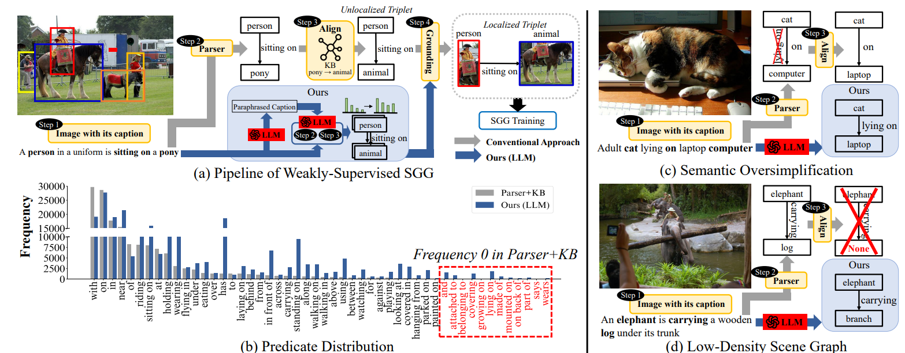
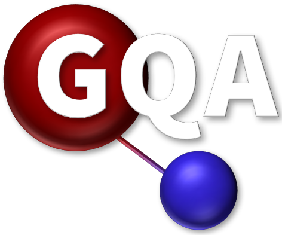

# LLM4SGG: Large Language Models for Weakly Supervised Scene Graph Generation  


The official source code for [LLM4SGG: Large Language Models for Weakly Supervised Scene Graph Generation](https://openaccess.thecvf.com/content/CVPR2024/papers/Kim_LLM4SGG_Large_Language_Models_for_Weakly_Supervised_Scene_Graph_Generation_CVPR_2024_paper.pdf), accepted at [CVPR 2024](https://cvpr.thecvf.com/).

## **Overview**    

 
<!--    -->

Addressing two issues inherent in the conventional approach([Parser](https://github.com/vacancy/SceneGraphParser)+Knowledge Base([WordNet](https://dl.acm.org/doi/pdf/10.1145/219717.219748)))  

* **Semantic Over-simplification (Step 2)**  
The standard scene graph parser commonly leads to converting the fine-grained predicates into coarse-grained predicates, which we refer to as semantic over-simplification. For example, in Figure (c), an informative predicate *lying on* in the image caption is undesirably converted into a less informative predicate *on*, because the scene parser operating on rule-based fails to capture the predicate *lying on* at once, and its heuristic rules fall short of accommodating the diverse range of caption's structure. As a result, in Figure (b), the predicate distribution follows long-tailedness. To make matter worse, <span style="color:red">12 out of 50 predicates</span> are non-existent, which means that these 12 predicates can never be predicted. 

* **Low-density Scene Graph (Step 3)**  
The triplet alignment based on knowledge base (i.e., WordNet) leads to low-density scene graphs, i.e., the number of remaining triplets after Step 3 is small. Specifically, a triplet is discarded if any of three components (i.e., subject, predicate, object) or their synonym/hypernym/hyponym within the triplet fail to align with the entity or predicate classes in the target data. For example, in Figure (d), the triplet *<elephant, carrying, log>* is discarded because *log* does not exist in the target data nor its synonym/hypernym, even if *elephant* and *carrying* do exist. As a result, a large number of predicates is discarded, resulting in a poor generalization and performance degradation. This is attributed to the fact that the static structured knowledge of KB is insufficient to cover the semantic relationships among a wide a range of words.  

### Proposed Approach: LLM4SGG  

To alleviate the two issues aforementioned above, we adopt a pre-trained Large Language Model (**LLM**). Inspired by the idea of Chain-of-Thoughts ([CoT](https://arxiv.org/pdf/2201.11903.pdf)), which arrives at an answer in a stepwise manner, we seperate the triplet formation process into two chains, each of which replaces the rule-based parser in Step 2 (i.e., [Chain-1](#chain-1-triplet-extraction-via-llm)) and the KB in Step 3 (i.e., [Chain-2](#chain-2-alignment-of-classes-in-triplets-via-llm)). 

Regarding an LLM, we employ *gpt-3.5-turbo* in [ChatGPT](https://chat.openai.com/).

##  TODO List  

- [x] Release prompts and codes for training the model with Conceptual caption dataset
- [x] Release enhanced scene graph datasets of Conceptual caption
- [x] Release prompts and codes for training the model with Visual Genome caption dataset
- [x] Release enhanced scene graph datasets of Visual Genome caption

##  **Installation**  


``` python  
conda create -n llm4sgg python=3.9.0 -y
conda activate llm4sgg

pip install torch==1.10.0+cu111 torchvision==0.11.0+cu111 torchaudio==0.10.0 -f https://download.pytorch.org/whl/torch_stable.html
pip install openai einops shapely timm yacs tensorboardX ftfy prettytable pymongo tqdm numpy python-magic pandas
pip install transformers==4.35.0
```
Once the package has been installed, please run `setup.py` file.
``` python  
python setup.py build develop --user
```  


##  **Dataset**  

Please refer to [dataset/README.md](dataset/README.md)


##  Triplet Extraction Process

You can find detailed explanation of triplet extraction process in [triplet_extraction_process/README.md](./triplet_extraction_process/README.md)


## **Train**  
The detailed paths of localized triplets are in [*maskrcnn_benchmark/config/paths_catalog.py*](https://github.com/rlqja1107/torch-LLM4SGG/blob/master/maskrcnn_benchmark/config/paths_catalog.py) file. 


###  Test set: VG

Models trained on caption datasets (e.g., `COCO`, `CC`, and `VG Caption`) are evaluated on VG test dataset.

The required file (i.e., localized triplets made by LLM4SGG) and pre-trained model (i.e., GLIP) will be automatically downloaded to facilitate your implementation. Simply change the `DATASET` name as needed. 

*※ The required files for Grounded Scene Graphs could not be downloaded due to the web error. If you have this problem, please visit https://huggingface.co/datasets/kb-kim/LLM4SGG and directly download the files.*

#### Single GPU
```python  
# DATASET: coco,cc,and vgcaption
bash scripts/single_gpu/train_{DATASET}4vg.sh
``` 
#### Multi GPU
```python  
# DATASET: coco,cc,and vgcaption
bash scripts/multi_gpu/train_{DATASET}4vg.sh
``` 


If you want to train model with reweighting strategy, please run the code.

```python  
# Training data: COCO
bash scripts/{multi_gpu or single_gpu}/train_coco4vg_rwt.sh
``` 

###  Test set: GQA

```python  
bash scripts/{multi_gpu or single_gpu}/train_coco4gqa.sh
``` 


## **Test**

```python  
# Please change model checkpoint in test.sh file
bash scripts/test.sh 
``` 
We also provide pre-trained models and other results. The link for Grounded Scene Graphs is connected to Google Drive.

###  COCO →  VG test  
* [model_VG_VS3.pth](https://drive.google.com/file/d/17B6xl5kVB62Z6DXcH8mN4JLMgyVNzjK1/view?usp=sharing), [config.yml](https://drive.google.com/file/d/1uloVluYT2nV_HweHk-A15BeCoYZzpne-/view?usp=sharing), [evaluation_res.txt](https://drive.google.com/file/d/1Hsy0nqRa_J61Yhqp-lJ_XxLl2D4pBCw1/view?usp=sharing)   
* [model_VG_VS3_Rwt.pth](https://drive.google.com/file/d/1PcuYZoFCh4_I9ohhDn69koovbcUiSTkh/view?usp=sharing), [config.yml](https://drive.google.com/file/d/1ISAKROhclmjQiiXxJQymmOhxpn6uOwr2/view?usp=sharing), [evaluation_res.txt](https://drive.google.com/file/d/1vNkMs9TiAwb3wMJjaup85LZTIneOHJZt/view?usp=sharing)

* Grounded Scene Graphs: [aligned_triplet_coco4cg_grounded.json](https://drive.google.com/file/d/15d5nmJHO4AVDLnXvq7l9VfMarXBkqH9A/view?usp=sharing)


###  VG Caption →  VG test  

* Chain 1 Output: [misaligned_triplets_vg_caption.json](https://drive.google.com/file/d/1xeSA-PM_UylYLDwv_IUmJv5AwkLWVlZr/view?usp=sharing)  
* Chain 2 Output: [aligned_entity_dict_vg_caption4vg.pkl](https://drive.google.com/file/d/1hnMqe0kQbEmp2iaC9fhd9RECX-TSyHDL/view?usp=sharing), [aligned_predicate_dict_vg_caption4vg.pkl](https://drive.google.com/file/d/15FF_kQRz9a-ZM-684nFqnT4i17a4-Z2V/view?usp=sharing)  
* Grounded Scene Graphs: [aligned_triplet_vgcaption4vg_grounded.json](https://drive.google.com/file/d/1Q3XFmeJPbH-4wB20oXfOAA0fCSQTWc2Q/view?usp=sharing)  

* Training Result: [evaluation_res.txt](https://drive.google.com/file/d/1q0fhzJEkg_3481GOrNjimbxKS7eSHzMA/view?usp=sharing)

###  CC →  VG test  

* Chain 1 Output: [misaligned_triplets_cc.json](https://drive.google.com/file/d/1wTUozYXxWYl9J6hzesxjVnPgMU_9nUXX/view?usp=sharing)  
* Chain 2 Output: [aligned_entity_dict_cc4vg.pkl](https://drive.google.com/file/d/1hQhRQT5HQ6KH3NvaXu6pd5_gx7yV5t9v/view?usp=sharing), [aligned_predicate_dict_cc4vg.pkl](https://drive.google.com/file/d/14d1BlJ2D1h0W1Q2-OTQHAX3ifmjPVvRq/view?usp=sharing)  
* Grounded Scene Graphs: [aligned_triplet_cc4vg_grounded.json](https://drive.google.com/file/d/1iItCiKzdRF7S-eWSXKtQiN2_sK6SfN0_/view?usp=sharing)  


* Training Result: [model_CC4VG.pth](https://drive.google.com/file/d/1JqYdC42aKiBioObN3EKe3b9iTPUROt5k/view?usp=sharing),  [evaluation_res.text](https://drive.google.com/file/d/1tkpsUTJvnW8g59bAeYuCmBFCY3IqJCOe/view?usp=sharing)  


###  COCO →  GQA test  
* [model_GQA_VS3.pth](https://drive.google.com/file/d/16gwBc1ucjZoFhXm3VGJ5zy9htyLk5xLF/view?usp=sharing), [config.yml](https://drive.google.com/file/d/13eETIHQSCCGwlk6ZOEIUb_JwsXldUFnf/view?usp=sharing), [evaluation_res.txt](https://drive.google.com/file/d/1Zy5xpEGRT79PlKNUKsgLK0dK-aMJmTz5/view?usp=sharing)   
* Grounded Scene Graphs: [aligned_triplet_coco4gqa_grounded.json](https://drive.google.com/file/d/1WukiY2YpuMxnBOdVuATWgjqr7xMRJ1AA/view?usp=sharing)


## Citation  

``` 
@InProceedings{Kim_2024_CVPR,
    author    = {Kim, Kibum and Yoon, Kanghoon and Jeon, Jaehyeong and In, Yeonjun and Moon, Jinyoung and Kim, Donghyun and Park, Chanyoung},
    title     = {LLM4SGG: Large Language Models for Weakly Supervised Scene Graph Generation},
    booktitle = {Proceedings of the IEEE/CVF Conference on Computer Vision and Pattern Recognition (CVPR)},
    month     = {June},
    year      = {2024},
    pages     = {28306-28316}
}
```


## Acknowledgement  

The code is developed on top of [VS3](https://github.com/zyong812/VS3_CVPR23).