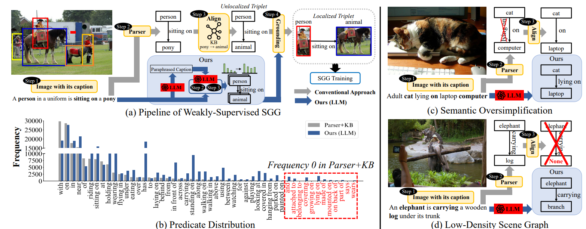
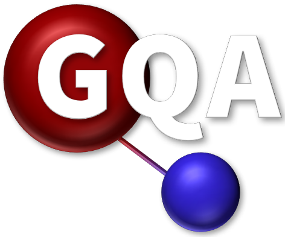

# LLM4SGG: Large Language Model for Weakly Supervised Scene Graph Generation  


The official source code for [LM4SGG: Large Language Model for Weakly Supervised Scene Graph Generation](https://arxiv.org/abs/2310.10404), accepted at [CVPR 2024](https://cvpr.thecvf.com/).

## **Overview**    


<!--    -->

Addressing two issues inherent in the conventional approach([Parser](https://github.com/vacancy/SceneGraphParser)+Knowledge Base([WordNet](https://dl.acm.org/doi/pdf/10.1145/219717.219748)))  

* **Semantic Over-simplification (Step 2)**  
The standard scene graph parser commonly leads to converting the fine-grained predicates into coarse-grained predicates, which we refer to as semantic over-simplification. For example, in Figure (c), an informative predicate *lying on* in the image caption is undesirably converted into a less informative predicate *on*, because the scene parser operating on rule-based fails to capture the predicate *lying on* at once, and its heuristic rules fall short of accommodating the diverse range of caption's structure. As a result, in Figure (b), the predicate distribution follows long-tailedness. To make matter worse, <span style="color:red">12 out of 50 predicates</span> are non-existent, which means that these 12 predicates can never be predicted. 

* **Low-density Scene Graph (Step 3)**  
The triplet alignment based on knowledge base (i.e., WordNet) leads to low-density scene graphs, i.e., the number of remaining triplets after Step 3 is small. Specifically, a triplet is discarded if any of three components (i.e., subject, predicate, object) or their synonym/hypernym/hyponym within the triplet fail to align with the entity or predicate classes in the target data. For example, in Figure (d), the triplet *<elephant, carrying, log>* is discarded because *log* does not exist in the target data nor its synonym/hypernym, even if *elephant* and *carrying* do exist. As a result, a large number of predicates is discarded, resulting in a poor generalization and performance degradation. This is attributed to the fact that the static structured knowledge of KB is insufficient to cover the semantic relationships among a wide a range of words.  

### Proposed Approach: LLM4SGG  

To alleviate the two issues aforementioned above, we adopt a pre-trained Large Language Model (**LLM**). Inspired by the idea of Chain-of-Thoughts ([CoT](https://arxiv.org/pdf/2201.11903.pdf)), which arrives at an answer in a stepwise manner, we seperate the triplet formation process into two chains, each of which replaces the rule-based parser in Step 2 (i.e., [Chain-1](#chain-1-triplet-extraction-via-llm)) and the KB in Step 3 (i.e., [Chain-2](#chain-2-alignment-of-classes-in-triplets-via-llm)). 

Regarding an LLM, we employ *gpt-3.5-turbo* in [ChatGPT](https://chat.openai.com/).

##  TODO List  

- [ ] Release prompts and codes for training the model with Conceptual caption dataset
- [ ] Release enhanced scene graph datasets of Conceptual caption
- [ ] Release prompts and codes for training the model with Visual Genome caption dataset
- [ ] Release enhanced scene graph datasets of Visual Genome caption

##  **Installation**  
Python: 3.9.0

``` python  
conda install pytorch==1.10.1 torchvision==0.11.2 cudatoolkit=11.3 -c pytorch -c conda-forge
pip install openai 
pip install einops shapely timm yacs tensorboardX ftfy prettytable pymongo tqdm pickle numpy
pip install transformers 
```
Once the package has been installed, please run `setup.py` file.
``` python  
python setup.py build develop --user
```  


##  **Dataset**  

Directory Structure  

```
root  
├── dataset 
│   ├── COCO     
│   │    │── captions_train2017.json    
│   │    │── captions_val2017.json
│   │    │── COCO_triplet_labels.npy    
│   │    └── images 
|   │         └── *.png        
│   ├── VG
│   │    │── image_data.json
│   │    │── VG-SGG-with-attri.h5
│   │    │── VG-SGG-dicts-with-attri.json
│   │    └── VG_100K
│   │         └── *.png 
│   ├── GQA
│   │    │── GQA_200_ID_Info.json
│   │    │── GQA_200_Train.json
│   │    │── GQA_200_Test.json
│   │    └── images
│   │         └── *.png
```


###  **Training data** 

To train SGG model, we use image caption with its image in `COCO` dataset. Please download the [COCO](https://cocodataset.org/#download) dataset and put the corresponding files into *dataset/COCO* directory. The name of files in url are:

> 2017 Traing images [118K/18GB]  
> 2017 Val images [5K/1GB]  
> 2017 Train/Val annotations [241MB]   

Note that after downloading the raw images, please combine them into *dataset/COCO/images* directory. For a fair comparison, we use 64K images, following the previous studies ([SGNLS](https://github.com/YiwuZhong/SGG_from_NLS), [Li et al, MM'22](https://github.com/xcppy/WS-SGG)). Please download a [file](https://drive.google.com/file/d/1kXVsecabQig2aC8KUpDb831J5_e-aJrl/view?usp=sharing) including the image id of 64K images. 

 

### **Test data**    
For evaluation, we use `Visual Genome (VG)` and `GQA` datasets. 

####  VG  

We follow the same pre-processing strategy with [VS3_CVPR23](https://github.com/zyong812/VS3_CVPR23). Please download the linked files to prepare necessary files.

* Raw Images: [part 1 (9GB)](https://cs.stanford.edu/people/rak248/VG_100K_2/images.zip), [part 2 (5GB)](https://cs.stanford.edu/people/rak248/VG_100K_2/images2.zip)  
* Annotation Files: [image_data.json](https://drive.google.com/file/d/1kl7Opx3niinxSW9ZePoHknOznqrSdWAE/view?usp=sharing), [VG-SGG-dicts-with-attri.json](https://drive.google.com/file/d/156cp5uPAjarosLZZeshHz3evIGUW8vLw/view?usp=sharing), [VG-SGG-with-attri.h5](https://drive.google.com/file/d/143Rs_zh6Wpc3wn1wQkztpau0-UFhB7sg/view?usp=sharing)

After downloading the raw images and annotation files, please put them into *dataset/VG/VG_100K* and *dataset/VG* directory, respectively.  


####  GQA  

We follow the same-preprocessing strategy with [SHA-GCL-for-SGG](https://github.com/dongxingning/SHA-GCL-for-SGG). Please download the linked files to prepare necessary files.  

* Raw Images: [Full (20.3GB)](https://downloads.cs.stanford.edu/nlp/data/gqa/images.zip)   
* Annotation Files: [GQA_200_ID_Info.json](https://drive.google.com/file/d/1eDZfLqV5sPteIWLxb432HwlMTXmeq4CI/view?usp=sharing), [GQA_200_Test.json](https://drive.google.com/file/d/1nS0jDbQf73aWbjtyQ_sZyBoAHDucPn8o/view?usp=sharing), [GQA_200_Train.json](https://drive.google.com/file/d/1-QQ4PVYIKsDq7An9VRj2AXRQFgdIkGxC/view?usp=sharing)

After downloading the raw images and annotation files, please put them into *dataset/GQA/images* and *dataset/GQA* directory, respectively.


##  **Triplet Extraction Process via LLM - VG**  

To utilize *gpt-3.5-turbo* in ChatGPT, please insert your openai key which is obtained from [https://platform.openai.com/account/api-keys](https://platform.openai.com/account/api-keys) 

Please follow step by step to obtain localized triplets.


### Chain-1: Triplet Extraction via LLM

Since triplet extraction via LLM is based on openAI's API, the code can be runned in parallel. For example, 10,000 images can be divided into 1,000 images with 10 codes. To this end, please change *start* and *end* variables in `.py` code, and name of saved files to avoid overwriting files.

* Extract triplets from original captions  
``` python  
python triplet_extraction_process/extract_triplet_with_original_caption.py {API_KEY}
```   


* Extract triplets from paraphrased captions
``` python  
python triplet_extraction_process/extract_triplet_with_paraphrased_caption.py {API_KEY}
```   
After **Chain-1**, the output files are located in *dataset/COCO* directory. The files containing misaligned triplets can be downloaded as:

* [dataset/COCO/misaligned_triplets_original.pkl](https://drive.google.com/file/d/1eEZ5CqYPJCI_jYaEBCBgESnI4EX4uSgM/view?usp=sharing) 

* [dataset/COCO/misaligned_triplets_paraphrased.pkl](https://drive.google.com/file/d/17cef1jJIw0zpdlm2zlIGo9Ozfp3OnkP7/view?usp=sharing)  

### Chain-2: Alignment of Classes in Triplets via LLM

``` python  
python triplet_extraction_process/alignment_classes_vg.py {API_KEY}
```   

After **Chain-2**, the output files are located in *triplet_extraction_process/alignment_dict* directory. The files containing aligned entity/predicate information can be downloaded as:

* [triplet_extraction_process/alignment_dict/aligned_entity_dict_vg.pkl](https://drive.google.com/file/d/1nbmggHoWEywC1GCN4EIPqaIx3NrGJew8/view?usp=sharing)  

* [triplet_extraction_process/alignment_dict/aligned_predicate_dict_vg.pkl](https://drive.google.com/file/d/1ZLtfhPuw4tv56eqH2b6F7SUNgtXOph74/view?usp=sharing)  


### Construction of aligned triplets in VS3 format  


``` python  
python triplet_extraction_process/final_preprocess_triplets_vg.py
```   
After **Final** instruction, the output file is located in *dataset/VG* directory. The file containing aligned triplets in VS3 format can be downloaded as follows:

* [dataset/VG/aligned_triplet_info_vg.json](https://drive.google.com/file/d/14UrH6SCH-64CP0vuaoUZaYYN2sXploWi/view?usp=sharing)  

### Grounding Unlocalized Triplets  

We follow same code in [VS3](https://github.com/zyong812/VS3_CVPR23/blob/main/tools/data_preprocess/parse_SG_from_COCO_captionV2.py) to ground unlocalized triplets. A pre-trained [GLIP](https://github.com/microsoft/GLIP) model is necessary to ground them. Please put the pre-trained GLIP model to *MODEL* directory. 
``` python  
# Download pre-trained GLIP models
mkdir MODEL
wget https://penzhanwu2bbs.blob.core.windows.net/data/GLIPv1_Open/models/glip_tiny_model_o365_goldg_cc_sbu.pth -O swin_tiny_patch4_window7_224.pth
wget https://penzhanwu2bbs.blob.core.windows.net/data/GLIPv1_Open/models/glip_large_model.pth -O swin_large_patch4_window12_384_22k.pth
```  

``` python  
# Grounding unlocalized triplets
python tools/data_preprocess/parse_SG_from_COCO_caption_LLM_VG.py
```  

After grounding unlocalized triplets, the output file named *aligned_triplet_info_vg_grounded.json* is located in *dataset/VG* directory. The file of localized triplets can be downloaded as follows:
* [dataset/VG/aligned_triplet_info_vg_grounded.json](https://drive.google.com/file/d/10m30Zx-sU_oUf3pFJU4M-YajBG7dweFM/view?usp=sharing)  


##  **Triplet Extraction Process via LLM - GQA**

Based on the extracted triplets in [Chain-1](#chain-1-triplet-extraction-via-llm), please run the below codes, similar to the process in [Triplet Extraction Process via LLM - VG](#triplet-extraction-process-via-llm---vg)

``` python  
# Chain-2: Alignment of Classes in Triplets via LLM 
python triplet_extraction_process/alignment_classes_gqa.py {API_KEY}
# Construction of aligned tripelts in VS3 format
python triplet_extraction_process/final_preprocess_triplets_gqa.py
# Grounding Unlocalized Triplets
python tools/data_preprocess/parse_SG_from_COCO_caption_LLM_GQA.py
```   

We provide files regarding GQA dataset.  

* [aligned_entity_dict_gqa.pkl](https://drive.google.com/file/d/1pV5VlcFGmL0PFU7bRqVvNKXhYtiMP9_p/view?usp=sharing), [aligned_predicate_dict_gqa.pkl](https://drive.google.com/file/d/1K-50K2mioFwF1T6VqU-C1sSjNYyXcUza/view?usp=sharing)
* [aligned_triplet_info_gqa_grounded.json](https://drive.google.com/file/d/1PW2UbRHQD4mXcFwmQxbzWnpyEHO1oQB7/view?usp=sharing)


## **Training model**  
To change localized triplets constructed by LLM, please change `cococaption_scene_graph` path in [*maskrcnn_benchmark/config/paths_catalog.py*](https://github.com/rlqja1107/torch-LLM4SGG/blob/master/maskrcnn_benchmark/config/paths_catalog.py) file.

###  VG

Please change variable in `cococaption_scenegraph` to *dataset/VG/aligned_triplet_info_vg_grounded.json* (localized triplets).
```python  
bash train_vg.sh
``` 

If you want to train model with reweighting strategy, please run the code.

```python  
bash train_rwt_vg.sh
``` 

###  GQA
Please change variable in `cococaption_scenegraph` to *dataset/GQA/aligned_triplet_info_gqa_grounded.json* (localized triplets). After changing variable, please run the code.
```python  
bash train_gqa.sh
``` 


## **Test**

```python  
# Please change model checkpoint in test.sh file
bash test.sh 
``` 
We also provide pre-trained models. 

###  VG
* [model_VG_VS3.pth](https://drive.google.com/file/d/17B6xl5kVB62Z6DXcH8mN4JLMgyVNzjK1/view?usp=sharing), [config.yml](https://drive.google.com/file/d/1uloVluYT2nV_HweHk-A15BeCoYZzpne-/view?usp=sharing), [evaluation_res.txt](https://drive.google.com/file/d/1Hsy0nqRa_J61Yhqp-lJ_XxLl2D4pBCw1/view?usp=sharing)   
* [model_VG_VS3_Rwt.pth](https://drive.google.com/file/d/1PcuYZoFCh4_I9ohhDn69koovbcUiSTkh/view?usp=sharing), [config.yml](https://drive.google.com/file/d/1ISAKROhclmjQiiXxJQymmOhxpn6uOwr2/view?usp=sharing), [evaluation_res.txt](https://drive.google.com/file/d/1vNkMs9TiAwb3wMJjaup85LZTIneOHJZt/view?usp=sharing)

###  GQA  
* [model_GQA_VS3.pth](https://drive.google.com/file/d/16gwBc1ucjZoFhXm3VGJ5zy9htyLk5xLF/view?usp=sharing), [config.yml](https://drive.google.com/file/d/13eETIHQSCCGwlk6ZOEIUb_JwsXldUFnf/view?usp=sharing), [evaluation_res.txt](https://drive.google.com/file/d/1Zy5xpEGRT79PlKNUKsgLK0dK-aMJmTz5/view?usp=sharing)   

## Citation  

``` 
@misc{kim2023llm4sgg,
      title={LLM4SGG: Large Language Model for Weakly Supervised Scene Graph Generation}, 
      author={Kibum Kim and Kanghoon Yoon and Jaehyeong Jeon and Yeonjun In and Jinyoung Moon and Donghyun Kim and Chanyoung Park},
      year={2023},
      eprint={2310.10404},
      archivePrefix={arXiv},
      primaryClass={cs.CV}
}
```


## Acknowledgement  

The code is developed on top of [VS3](https://github.com/zyong812/VS3_CVPR23).